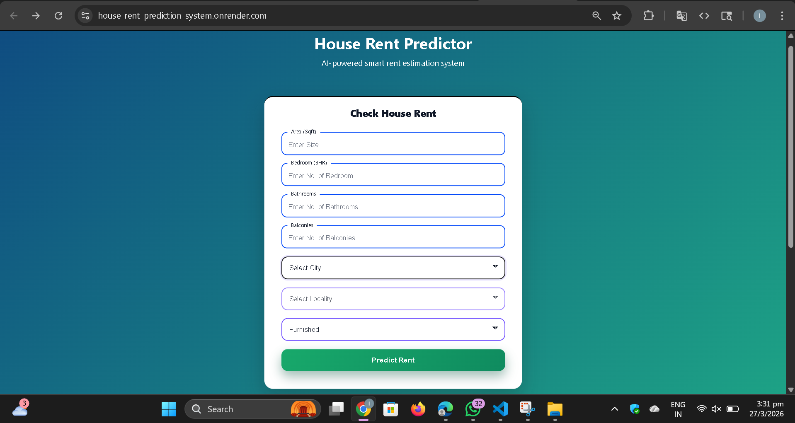
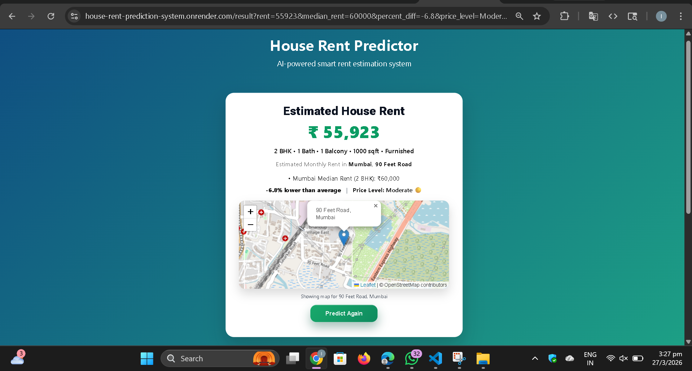

# 🏠 House Rent Prediction System

An end-to-end Machine Learning-powered web application that predicts house rent based on property features such as area, BHK, location, and furnishing.

 **Live Demo:** https://house-rent-prediction-system.onrender.com/

---

##  Features

- 🔹 Real-time house rent prediction using ML model  
- 🔹 Location-based insights (city & locality level)  
- 🔹 Market comparison using median rent analysis  
- 🔹 Price classification: Cheap / Moderate / Expensive  
- 🔹 Interactive map visualization (OpenStreetMap + Leaflet)  
- 🔹 Clean and responsive UI  
- 🔹 Full-stack implementation using Flask  

---
###  Input Page


###  Result Page


---

##  Data Cleaning & Preprocessing

- Removed missing and inconsistent values  
- Filtered unrealistic data:
  - Invalid area values (0 or negative sqft)  
  - Extremely high/low rent values  
  - Abnormal number of rooms (outliers)  
- Ensured dataset reflects realistic real-world properties  
- Processed categorical features for model compatibility  

---

##  Exploratory Data Analysis (EDA)

- Analyzed distributions of rent, area, and BHK  
- Identified and handled outliers  
- Explored relationships:
  - Area vs Rent  
  - BHK vs Rent  
  - City & Locality vs Rent  
- Used visualizations to extract actionable insights  

---

## ⚙️ Feature Engineering

- Applied log transformation on area to reduce skewness  
- Removed derived features that introduced redundancy or noise:
  - Dropped `total_rooms` (to avoid misleading feature relationships)  
  - Removed `rent_per_sqft` and `price_per_sqft` to prevent data leakage  
- Used target encoding for:
  - City  
  - Locality  

---

##  Model Training & Selection

- Trained and evaluated multiple regression models:
  - Random Forest Regressor  
  - XGBoost Regressor  
  - Decision Tree Regressor  
  - Linear Regression  

- Compared models using:
  - R² Score  
  - Generalization performance  

- Selected **Random Forest Regressor** as final model  
  due to superior accuracy and stability  

---

##  Model Comparison

| Model              | R² Score |
|-------------------|----------|
| Random Forest     | ~0.87    |
| XGBoost           | ~0.83    |
| Decision Tree     | ~0.76    |
| Linear Regression | ~0.45    |

---

##  Additional Logic

- Implemented BHK-based adjustment  
  to ensure realistic rent scaling with increasing bedrooms  

---  

## 🏗️ Tech Stack

- **Frontend:** HTML5, CSS3, JavaScript  
- **Backend:** Flask (Python)  
- **Machine Learning:** Scikit-learn, XGBoost, Random Forest, Decision Tree, Linear Regression  
- **Data Processing:** NumPy, Pandas  
- **Data Visualization:** Matplotlib, Seaborn  
- **Map Visualization:** Leaflet.js, OpenStreetMap  
- **Deployment:** Render  

---

##  Project Structure

house-rent-prediction-system/
│
├── app.py
├── utils.py
├── requirements.txt
├── Procfile
├── LICENSE
│
├── datasets/
│ ├── datasetindia_house_dataset.csv
│ └── fullcleaned_house_data.csv
│
├── model/
│ ├── house_model.pkl
│ └── encoders.pkl
│
├── notebooks/
│ ├── eda.ipynb
│ └── model_train.ipynb
│
├── templates/
│ ├── index.html
│ ├── result.html
│ ├── header.html
│ └── footer.html
│
├── static/
│ ├── style.css
│ └── main.js
│
└── assets/
├── input.png
└── result.png

```


---

##  How It Works

1. User inputs property details  
2. Data is sent to Flask backend  
3. ML model predicts rent  
4. System compares with market median  
5. Result is displayed with map visualization  

---

##  Future Improvements

- 🔹 Improved handling of out-of-range inputs  
- 🔹 Advanced feature engineering  
- 🔹 User authentication system  
- 🔹 Scalable production-grade API  

---

##  Author

**Satywan Prajapati**  
🎓 IIT Patna  

- 🔗 LinkedIn: https://www.linkedin.com/in/satywanprajapati/  
- 💻 GitHub: https://github.com/SatywanPrajapati  

